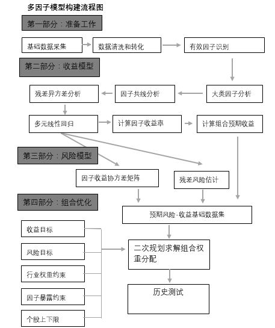
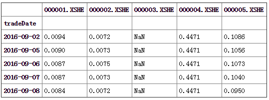

# 大纲
1. 使用多因子数据进行因子筛选有用的因子（目的是为了选择/组合 有用的因子，说白了是特征工程）
    
    1. 因子处理
        1. 针对单个因子
            1. 去极值
            2. 中性化，消除行业和风格因子等的影响
            3. 标准化
        2. 多因子
            1. 残差正交化调整，因子间存在较强同质性时，使用施密特正交化方法对因子做正交化处理，用得到的正交化残差作为因子
    2. 机器学习方法进行计算相关性，进行有效因子的挑选
        1. PCA
        2. 决策树等
    3. 计算股票收益协方差矩阵
        1. 协方差矩阵的意义
    4. 评价指标
        1. 因子IC（Information Coefficient），*本期因子值* 和 *下期股票收益*的秩相关系数
            1. IC的均值：可以判断该因子的有效性
            2. IC的标准差：可以判断该因子的稳定性
            3. IC 值序列大于零（或小于零）的占比：判断因子效果的一致性
        2. 协方差矩阵分配权重

2. 将多因子数据和时序数据合并成统一可输入神经网络的数据格式，可能需要用到混频的知识，参考论文
    1. Autoregressive Convolutional Neural Networks for Asynchronous Time Series
    2. Patient subtyping via time-aware LSTM Network

3. 使用model进行价格预测
    1. CNN
        1. 刚做的时候想法是找出典型位置，只在出现典型位置的情况下买入
    2. RNN
    3. GBDT(忽略了时序，直接当做多个属性来学)
    4. xgb

4. 使用reinforcement learning进行策略决策S

---

# 细节
1. 对于单个因子，读取每个文档中对应的数据，构造属于当前单因子的时序，从而进行预处理和评价

    
    
    这个数据结构中
    1. 只含有一个因子的数据
    2. 每行是一个日期
    3. 每列是一只个股

    然后把单因子的数据和收益放在一起，计算相关性，从而选择重要的因子
2. 